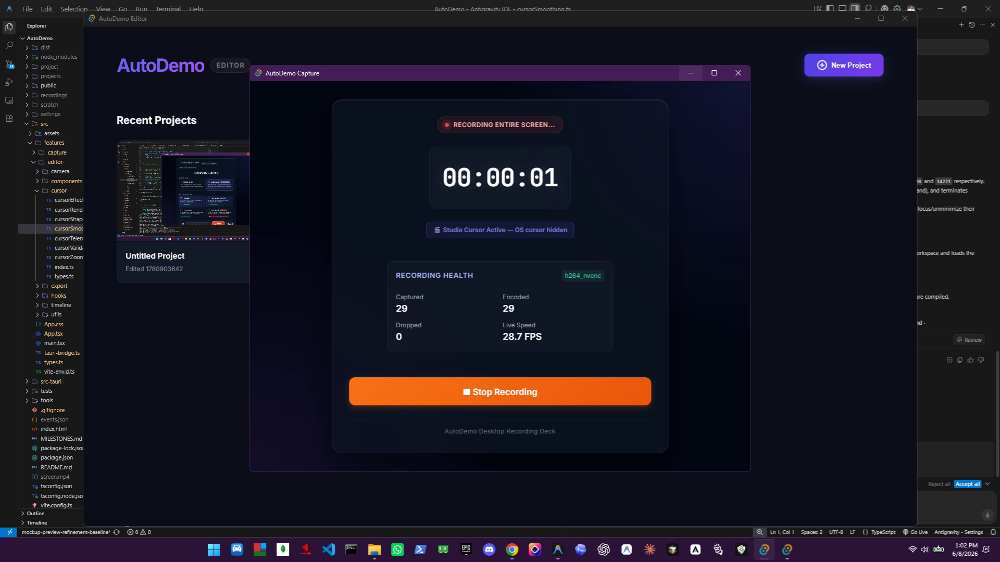
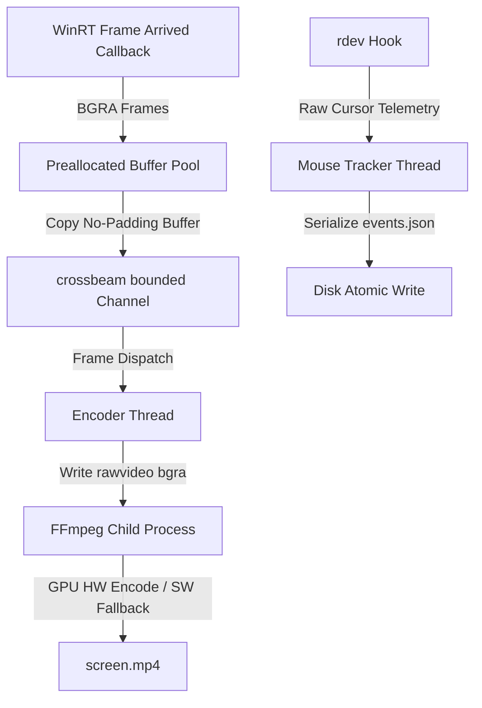

# AutoDemo: High-Fidelity Screen Recording & Video Production

Official distribution channel and release repository for **AutoDemo**.

AutoDemo is a high-performance desktop application designed to record screen activity and cursor telemetry, creating beautiful demo and tutorial videos with smooth, automated camera movements, zoom effects, and premium cursor animations.

> [!NOTE]
> The source code repository for AutoDemo is private. This repository serves as the public host for installer binaries, release assets, and auto-updater metadata.

---

## 📸 Application Preview

Here is the AutoDemo editing workspace and timeline in action:

### 🎥 Demo Recording
Watch the canvas preview, camera smoothing, and timeline zoom mechanics:

<video src="./demo.mp4" width="100%" controls></video>

---

## 🛠️ Architecture Overview

AutoDemo uses a hybrid architecture combining a high-performance, system-level Rust backend with a modern React/Vite frontend hosted inside a **Tauri v2** shell.

### Backend Engineering Design:
1. **Low-Latency Capture Pipeline:** Hooks into native **Windows Graphics Capture (WGC)** APIs via WinRT, delivering raw frames at 60/120 FPS directly from the Desktop Window Manager (DWM).
2. **Zero-Allocation Ring Buffer:** Combines lock-free `crossbeam-channel` structures with recycled memory buffers. This avoids standard garbage collection/allocation thrashing during high-speed capture.
3. **Dynamic GPU Probing:** Executes silent probes at startup to test hardware encoding acceleration (`h264_nvenc` for NVIDIA, `h264_amf` for AMD, `h264_qsv` for Intel QuickSync), falling back to software `libx264` if drivers are missing.
4. **Win32 Platform Integration:** Enforces 1ms scheduler resolution using multimedia timers (`timeBeginPeriod`), manages capture window display affinity to exclude application overlays, and runs TCP instance ports for single-instance focus.

---

## 📋 Feature Status & Roadmap

### ✅ Completed & Working Features
- **Capture Engine V2 (WGC):** Clean selection picker for primary/secondary monitors, target application windows, or custom coordinates.
- **UAC Secure Desktop Resilience:** Automatically freezes frames during security prompts and resumes recording without crashing or splitting sessions.
- **GPU Hardware Encoding:** Direct rawvideo stdin stream piping into FFmpeg process.
- **Cursor Telemetry tracking:** Standard global mouse hooks (`rdev`) capturing screen-space pointer movements and clicks in real time.
- **Premium Motion Engine:**
  - Curved Catmull-Rom path interpolation.
  - Velocity-based double EMA cursor glide.
  - Magnetic click easing and click spring scale animations.
  - Custom HD vector cursor mapping.
  - Squash-and-stretch motion blur.
- **Tauri v2 Desktop Shell:** Multi-window overlay panels and editor setups with cryptographically signed auto-updater routines.

### 🔄 In Progress
- **Timeline Core Refactor & Validation:** Merging the `TimelineProject` state model and range model, implementing rules checking overlaps, boundaries, and timestamps alignment before edit operations.
- **Timeline Corruption Auto-Recovery:** Automatic recovery rules for minor validation anomalies (e.g. clamping zoom spans exceeding boundaries) to ensure reliable compilation.

### 🚀 Upcoming Features (Roadmap)
- **Cross-Platform Support (macOS & Linux):**
  - *macOS:* Integrating ScreenCaptureKit for native hardware recording.
  - *Linux:* Integrating PipeWire and X11 capture bindings.
- **Timeline Boundary & Trimming System:** Interactive clip edge resize handles, split clips at playhead, and full history audit (`Undo/Redo` stacks via Ctrl+Z/Ctrl+Y).
- **Ripple Engine & Gap Closing:** Automatic click-to-close gap, ripple shifting segments/zooms chronologically.
- **Multi-Channel Audio & Captions:** Separate microphone and system audio channels, visual waveforms, noise suppression, and AI-powered dynamic subtitles.

---

## 📦 Distribution & Auto-Updates

Installed client copies of AutoDemo check for updates by querying this repository:
- **Tauri v2 Update Endpoint:** [updater-v2.json](./updater-v2.json)
- **Latest Release Registry:** [latest.json](./latest.json)
